# University project for final exam

This is a web application for giving anonymous feedbacks and collecting, analizing them. The application's frontend is written in ReactJS, the backend is written in NodeJS, which can execute python srcipts for analizing feedbacks. The application's data is stored  in Firebase realtime database and storage.

Demo: https://sapifeedback.herokuapp.com/

## It is useful for the users who:

* want to get feedback in order to improve, learn
* want to collect feedbacks CONTINUOUSLY
* want to collect feedbacks about more than one topic
* want to collect unstructured feedbacks (free text + image)
* want to anayzie feedbacks in order to extract useful information 

## About the project

### Types of user: 

* Logged in user: can create topics for collecting feedbacks, manage topics (create, archive, delete) and feedbacks (export, delete, analyze).
* Guest user: can give feedback to a given topic (prequisite: having the topic's id or the feedback url)

### Details:

* the application uses websockets for refreshing the UI in real time
* feedback texts are analized with the help of python scripts
* reCAPTCHA v2 is used for preventing bot attacks
* the application is responsive, it is easy to use on mobile device as well

### Technologies used:

* Frontend:
  * _reactJS, CSS, HTML5_
  * _Google OAuth 2.0_
  * _Google reCAPTCHA v2_
  * _Redux_          
  
* Backend:
  * _nodeJS_
  * _express_
  * _python (NLTK)_

* Database: 
  * _Firebase Realtime Database_
  * _Firebase Storage_ 

### Some important node packages:

* Frontend:
  * _reaviz_ (for generating figures)
  * _socket.io-client_ (websocket for realtime changes)
  * _react-router-dom_ (for creating routes)
  * _react-toastify_ (for notifications)
  * _react-google-login_ (for login)
  * _react-google-recaptcha_ (for preventing bot attacks)
  * _i18next_ (for internationalization)
  * _client-compress_ (for compressing feedback images)

* Backend:
  * _express_ (for handling http requests)
  * _firebase-admin_ (for communicating with cloud database)
  * _http-proxy-middleware_ (for creating proxy)
  * _python-shell_ (for executing python scripts)
  * _socket.io_ (websocket for realtime changes)

## Pages of the website

### Homepage

Here the user can log in with Google Account or can enter a topic's ID to give feedbacks to a given topic at the **Feedbacks page**.

<table align="center" >
  <tr>
    <td>Desktop</td>
     <td>Mobile</td>
  </tr>
  <tr>
    <td></td>
    <td></td>
  </tr>
 </table>
 
 ### User's topics page
 
 At this page the user can create topics and see, sort and filter the created topics. At the top of the page there is a navigation bar, where the user can see the profile information and can log out, and there is also a search bar for searching between the topics.
 
 <table align="center" >
  <tr>
    <td>Desktop</td>
     <td>Mobile</td>
  </tr>
  <tr>
    <td></td>
    <td></td>
  </tr>
 </table>
 
  <table align="center" >
  <tr>
    <td>Navbar</td>
  </tr>
  <tr>
    <td>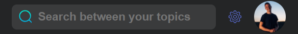</td>
  </tr>
 </table>

<table align="center" >
  <tr>
     <td>User's topics</td>
  </tr>
  <tr>
    <td></td>
  </tr>
 </table>
 
 If the user clicks on the **Add topic** card, a modal pops up where he/she can create a topic.
 
 <table align="center" >
  <tr>
    <td>Desktop</td>
     <td>Mobile</td>
  </tr>
  <tr>
    <td>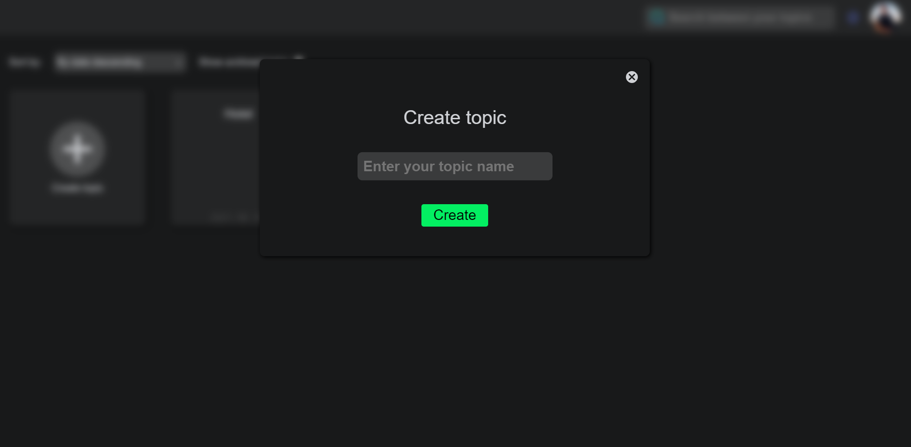</td>
    <td>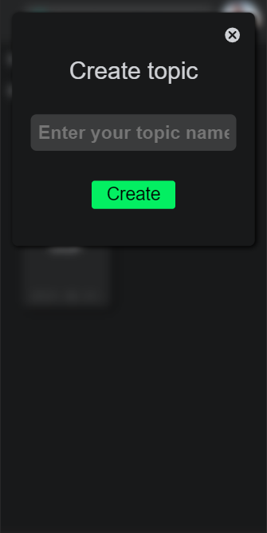</td>
  </tr>
 </table>
 
 At the topic card's options, the user can archive/activate the topic, and also can copy the topic's id and feedback page url to clipboard.
 
 <table align="center" >
  <tr>
     <td>Topic cards</td>
     <td>Topic card options</td>
  </tr>
  <tr>
    <td></td>
   <td></td>
  </tr>
 </table>

At the navbar there is a settings option, where the user can change the theme (dark/light) and the language of the application (english, hungarian).

<table align="center" >
  <tr>
     <td>Settings</td>
  </tr>
  <tr>
    <td></td>
  </tr>
 </table>
 
### Feedbacks page
 
Here the user can give feedback to a given topic. The feedback must contain a text and optionally an image. The images which are bigger than 1 MB, are compressed. In order to upload the feedback, the user has to solve a reCAPTCHA.

 <table align="center" >
  <tr>
    <td>Desktop</td>
     <td>Mobile</td>
  </tr>
  <tr>
    <td>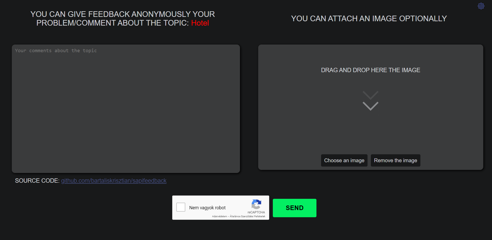</td>
    <td>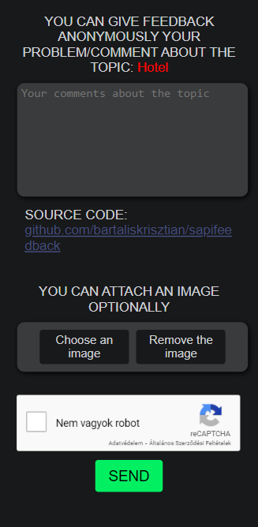</td>
  </tr>
 </table>
 
 On the next pages, there is a menu bar where the user can see all the information about a topic (details, feedbacks, analysis) and go back to **User's topics page**.
 
 <table align="center" >
  <tr>
    <td>Desktop</td>
     <td>Mobile</td>
  </tr>
  <tr>
    <td>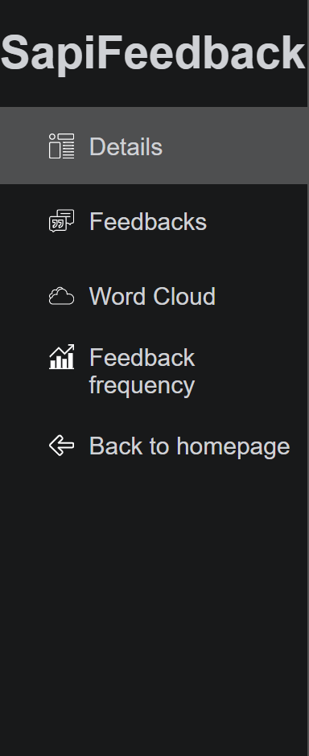</td>
    <td>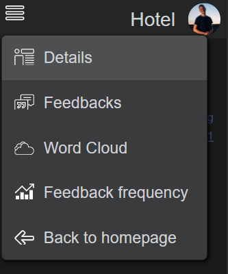</td>
  </tr>
 </table>
 
### Topic's details page

Here the user can see the details of the topic and can delete the topic with its feedbacks.

 <table align="center" >
  <tr>
     <td>Desktop</td>
     <td>Mobile</td>
  </tr>
  <tr>
    <td></td>
   <td></td>
  </tr>
 </table>
 
 ### Topic's feedbacks page
 
 Here the user can see all the feedbacks paginated, can delete them, see the uploaded pictures and export the feedbacks. If there is no image attached, a placeholder image is dsplayed.
 
 <table align="center" >
  <tr>
     <td>Desktop</td>
     <td>Mobile</td>
  </tr>
  <tr>
    <td>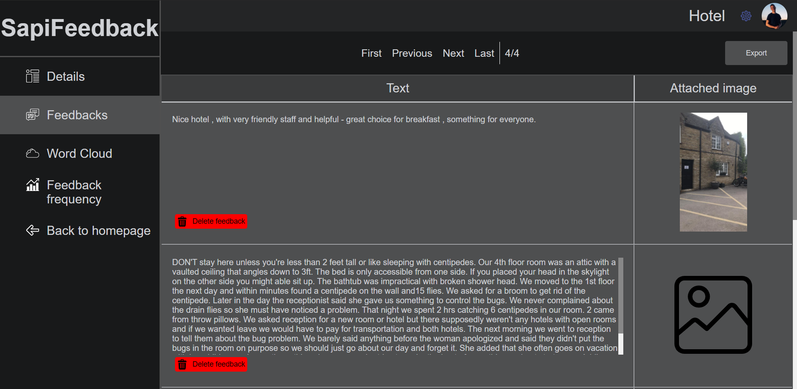</td>
   <td>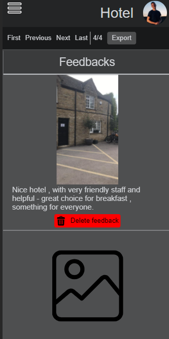</td>
  </tr>
 </table>

With the help of popup modals, the user can delete a feedback and also see the feedback's image.

 <table align="center" >
  <tr>
     <td>Delete feedback modal</td>
     <td>Feedback image modal</td>
  </tr>
  <tr>
    <td>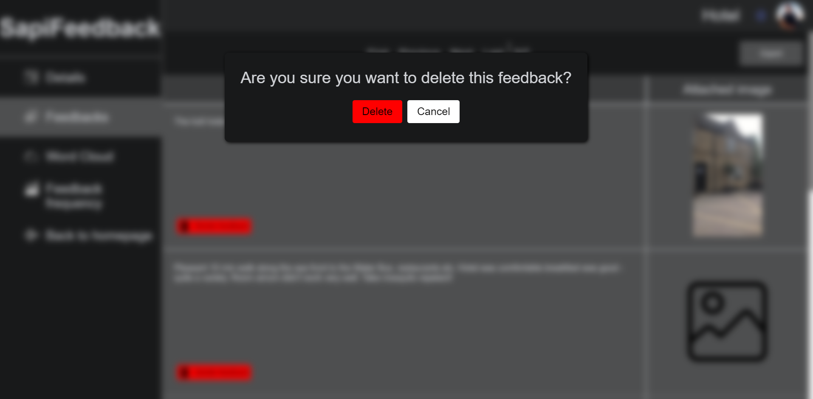</td>
   <td>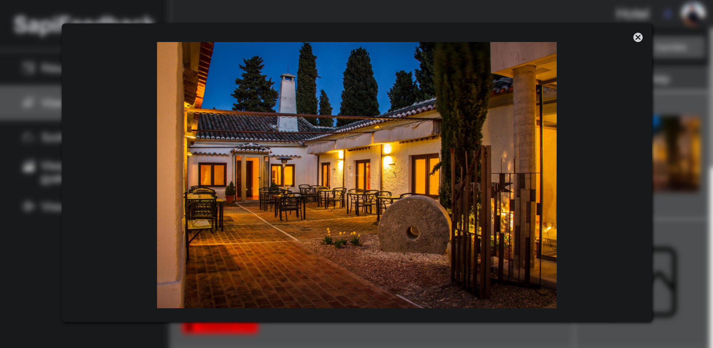</td>
  </tr>
 </table>

 ### Feedbacks's wordcloud page
 
 With the help of a python script a wordcloud is generated about the feedback texts, which is displayed in this page.
 
 <table align="center" >
  <tr>
     <td>Wordcloud</td>
  </tr>
  <tr>
    <td>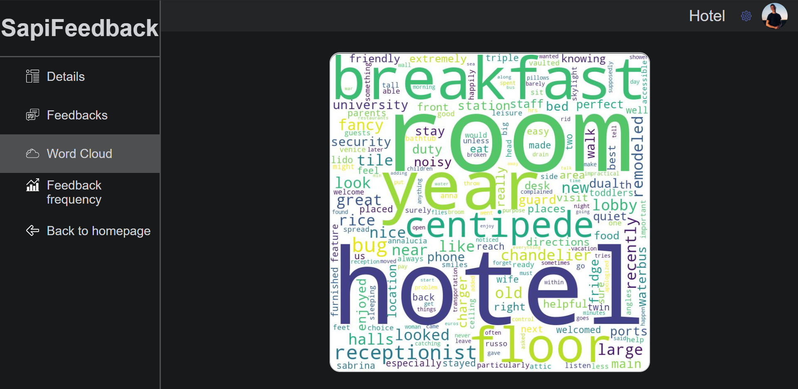</td>
  </tr>
 </table>
 
  ### Feedbacks's frequency page
  
  Here is displayed a figure about how frequent are the feedbacks uploaded.
  
  <table align="center" >
  <tr>
     <td>Desktop</td>
     <td>Mobile</td>
  </tr>
  <tr>
    <td>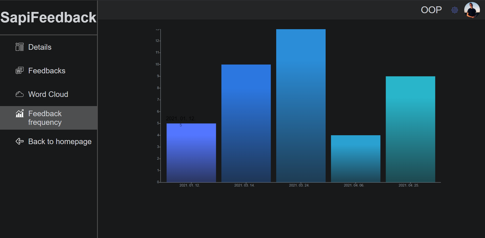</td>
   <td>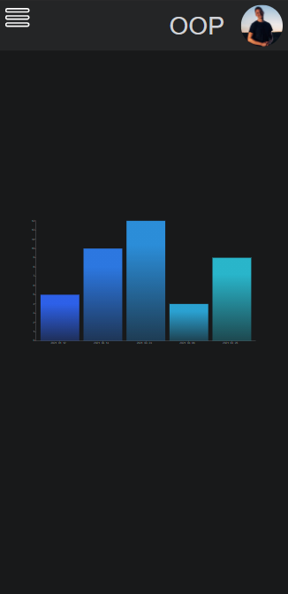</td>
  </tr>
 </table>
 
 ### Notification toasts
 
 The users are notificated with the help of 3 types of toasts: success, info, error.
 
<table align="center" >
  <tr>
     <td>Success</td>
     <td>Info</td>
     <td>Error</td>
  </tr>
  <tr>
    <td></td>
    <td>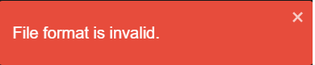</td>
    <td></td>
  </tr>
 </table>
 
 ### Application themes
 
 The application has two themes to display: light/dark.
 
  <table align="center" >
  <tr>
     <td>Light themed homepage</td>
     <td>Light themed user's topics page</td>
  </tr>
  <tr>
    <td>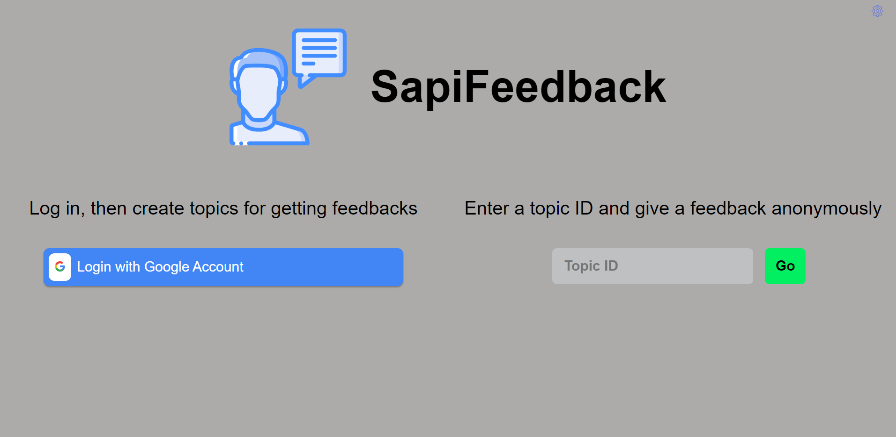</td>
   <td>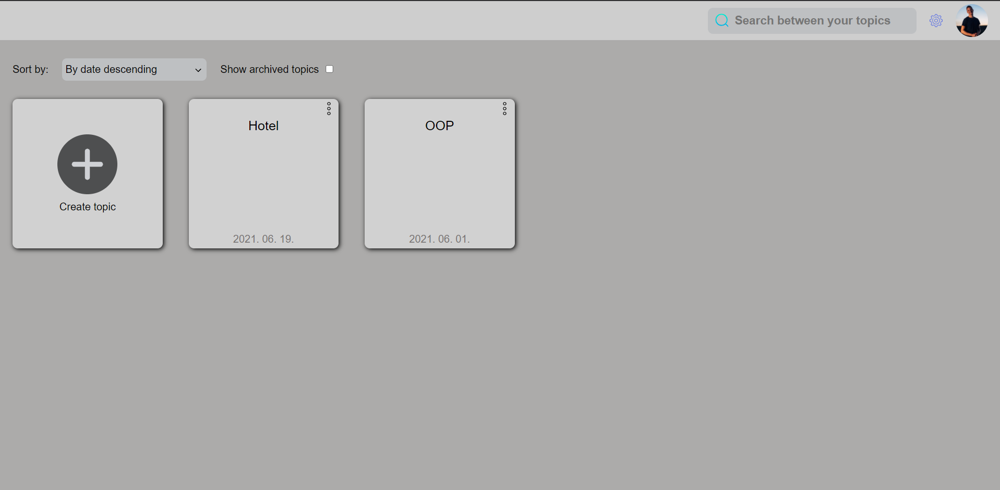</td>
  </tr>
 </table>
