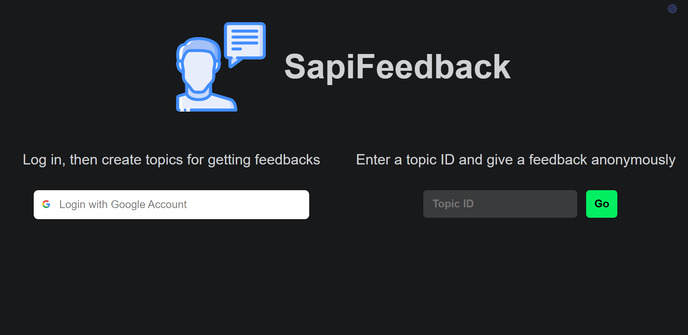
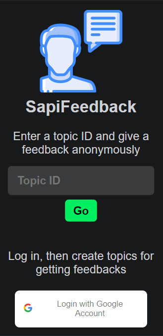
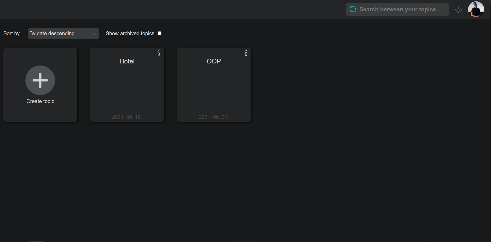
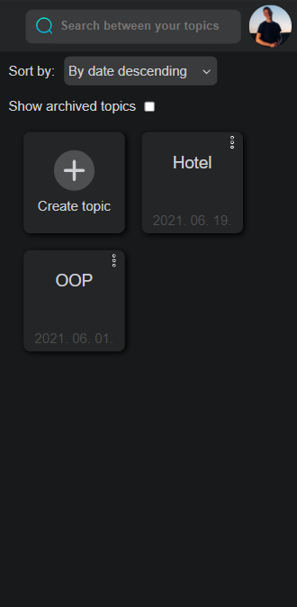

# University project for final exam

This is a web application for giving anonymous feedbacks and collecting, analizing them. The application's frontend is written in ReactJS, the backend is written in NodeJS, which can execute python srcipts for analizing feedbacks. The application's data is stored  in Firebase realtime database and storage.

Demo: https://sapifeedback.herokuapp.com/

## It is useful for the users who:

* want to get feedback in order to improve, learn
* want to collect feedbacks CONTINUOUSLY
* want to collect feedbacks about more than one topic
* want to collect unstructured feedbacks (free text + image)
* want to anayzie feedbacks in order to extract useful information 

## About the project

### Types of user: 

* Logged in user: can create topics for collecting feedbacks, manage topics (create, archive, delete) and feedbacks (export, delete, analyze).
* Guest user: can give feedback to a given topic (prequisite: having the topic's id or the feedback url)

### Details:

* the application uses websockets for refreshing the UI in real time
* feedback texts are analized with the help of python scripts
* reCAPTCHA v2 is used for preventing bot attacks
* the application is responsive, it is easy to use on mobile device as well

### Technologies used:

* Frontend:
  * reactJS, CSS, HTML5
  * Google OAuth 2.0
  * Google reCAPTCHA v2
  * Redux            
  
* Backend:
  * nodeJS
  * express
  * python (NLTK)

* Database: 
  * Firebase Realtime Database
  * Firebase Storage 

### Some important node packages:

* Frontend:
  * socket.io-client (websocket for realtime changes)
  * react-router-dom (for creating routes)
  * react-toastify (for notifications)
  * react-google-login (for login)
  * react-google-recaptcha (for preventing bot attacks)
  * i18next (for internationalization)
  * client-compress (for compressing feedback images)

* Backend:
  * express (for handling http requests)
  * firebase-admin (for communicating with cloud database)
  * http-proxy-middleware (for creating proxy)
  * python-shell (for executing python scripts)
  * socket.io (websocket for realtime changes)

## Pages of the website

### Homepage

Here th user can log in with Google Account or can enter a topic's ID to give feedbacks to a given topic at he Feedbacks page.

<table align="center" >
  <tr>
    <td>Desktop</td>
     <td>Mobile</td>
  </tr>
  <tr>
    <td></td>
    <td></td>
  </tr>
 </table>
 
 ### User's topics
 
 <table align="center" >
  <tr>
    <td>Desktop</td>
     <td>Mobile</td>
  </tr>
  <tr>
    <td></td>
    <td></td>
  </tr>
 </table>
